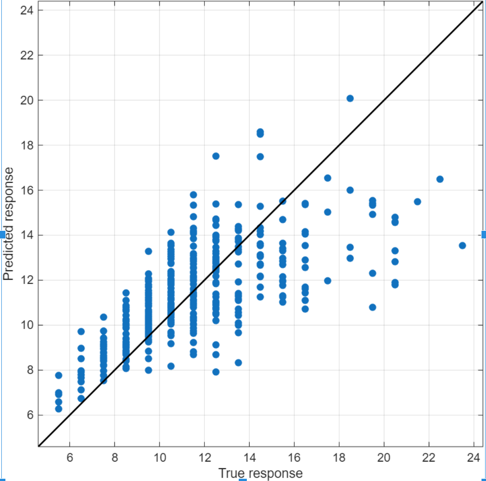
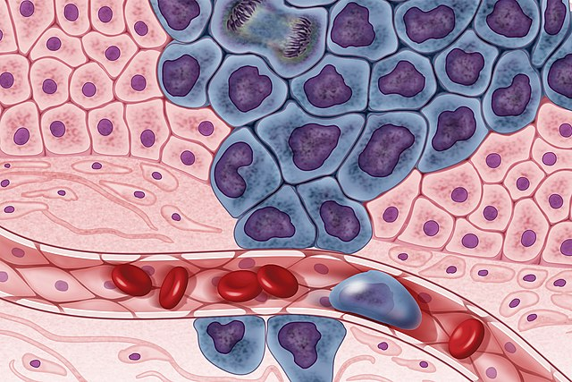
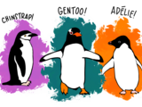

# Machine Learning for Biosciences

 or 

**Curriculum Module**

_Created with R2025a. Compatible with R2025a and later releases._

# Information

This curriculum module contains interactive [MATLAB® live scripts](https://www.mathworks.com/products/matlab/live-editor.html) that introduces basic machine learning algorithms  and apply them to biological datasets .

## Background

You can use these live scripts as demonstrations in lectures, class activities, or interactive assignments outside class. This module covers machine learning applied to various biosciences datasets. 

The instructions inside the live scripts will guide you through the exercises and activities. Get started with each live script by running it one section at a time. To stop running the script or a section midway (for example, when an animation is in progress), use the  Stop button in the **RUN** section of the **Live Editor** tab in the MATLAB Toolstrip.

## Contact Us

Contact the [MathWorks Educator Content Development Team](mailto:onlineteaching@mathworks.com) if you would like to provide feedback, or if you have a question.

## Prerequisites

This module assumes basic MATLAB® knowledge and we recommend that all students take the [MATLAB Onramp](https://matlabacademy.mathworks.com/details/matlab-onramp/gettingstarted) before continuing if they have not already. 

## Getting Started
### Accessing the Module
### **On MATLAB Online:**

Use the   link to download the module. You will be prompted to log in or create a MathWorks account. The project will be loaded, and you will see an app with several navigation options to get you started.

### **On Desktop:**

Download or clone this repository. Open MATLAB, navigate to the folder containing these scripts and double\-click on [MachineLearningBiosciences.prj](<matlab: openProject("MachineLearningBiosciences.prj")>) . It will add the appropriate files to your MATLAB path and open an app that asks you where you would like to start. 

Ensure you have all the required products ([listed below](#H_E850B4FF)) installed. If you need to include a product, add it using the Add\-On Explorer. To install an add\-on, go to the **Home** tab and select   **Add-Ons** > **Get Add-Ons**. 

## Products

MATLAB® is used throughout. Tools from the the [Statistics and Machine Learning Toolbox](https://www.mathworks.com/products/statistics.html)™ , [Deep Learning Toolbox](https://www.mathworks.com/help/deeplearning/index.html?searchHighlight=deeplearningtoolbox&s_tid=srchtitle_support_results_1_deeplearningtoolbox)™ are used frequently as well.

-  MATLAB® 
-  Deep Learning Toolbox™ 
-  Statistics and Machine Learning Toolbox™ 

# Scripts

## [**An Overview of Machine Learning for Science and Engineering**](https://matlab.mathworks.com/open/github/v1?repo=MathWorks-Teaching-Resources/Biosciences-Machine-Learning&project=MachineLearningBiosciences.prj&file=Scripts/IntrotoMachineLearning.mlx) 
||||
| :-- | :-- | :-- |
|     | **In this script, students will...**   $\bullet$ explain the primary goal of machine learning.   $\bullet$ distinguish between supervised and unsupervised learning.   $\bullet$ describe the key steps in a typical machine learning workflow.    | **Academic disciplines**   $\bullet$ Biosciences   $\bullet$ Biology   $\bullet$ AI | Machine Learning   $\bullet$ Engineering     |

## [**Unsupervised Learning**](https://matlab.mathworks.com/open/github/v1?repo=MathWorks-Teaching-Resources/Biosciences-Machine-Learning&project=MachineLearningBiosciences.prj&file=Scripts/UnsupervisedLearning.mlx) 
||||
| :-- | :-- | :-- |
|     | **In this script, students will...**   $\bullet$ apply Principal Component Analysis (PCA) to reduce dimensions of biosciences data.   $\bullet$ use k\-means clustering to identify natural groupings in unlabeled data.    $\bullet$ evaluate clustering performance using confusion matrices.     | **Academic disciplines**   $\bullet$ Biosciences   $\bullet$ Biology   $\bullet$ AI | Machine Learning     |

## [**Supervised Learning: Classification**](https://matlab.mathworks.com/open/github/v1?repo=MathWorks-Teaching-Resources/Biosciences-Machine-Learning&project=MachineLearningBiosciences.prj&file=Scripts/SupervisedLearningClassification.mlx) 
||||
| :-- | :-- | :-- |
|     | **In this script, students will...**   $\bullet$ train and evaluate models to classify disease using supervised learning.   $\bullet$ assess model performance with accuracy, confusion matrices, and ROC curves.   $\bullet$ improve accuracy using feature selection, PCA, and cost weighting.    | **Academic disciplines**   $\bullet$ Biosciences   $\bullet$ Biology   $\bullet$ AI | Machine Learning     |

## [**Supervised Learning: Regression**](https://matlab.mathworks.com/open/github/v1?repo=MathWorks-Teaching-Resources/Biosciences-Machine-Learning&project=MachineLearningBiosciences.prj&file=Scripts/SupervisedLearningRegression.mlx) 
||||
| :-- | :-- | :-- |
|     | **In this script, students will...**   $\bullet$ use supervised learning to train and evaluate regression models that predict mollusk age.   $\bullet$ evaluate and compare models using statistical performance metrics such as accuracy, confusion matrices, and RMSE.   $\bullet$ apply machine learning in biosciences.    | **Academic disciplines**   $\bullet$ Biosciences   $\bullet$ AI | Machine Learning     |

## [**Unsupervised Learning Problem Set**](https://matlab.mathworks.com/open/github/v1?repo=MathWorks-Teaching-Resources/Biosciences-Machine-Learning&project=MachineLearningBiosciences.prj&file=Scripts/UnsupervisedLearningPS.mlx) 
||||
| :-- | :-- | :-- |
|     | **In this script, students will...**   $\bullet$ apply unsupervised learning to a cancer cell dataset.    | **Academic disciplines**   $\bullet$ Biosciences   $\bullet$ Biology   $\bullet$ AI | Machine Learning     |

# License

The license for this module is available in the [LICENSE.md](./LICENSE.md).

# Related Courseware Modules

## [Machine Learning Methods: Clustering](https://www.mathworks.com/matlabcentral/fileexchange/135381-machine-learning-methods-clustering) 
|||
| :-- | :-- |
|     | **Available on:**           [GitHub](https://github.com/MathWorks-Teaching-Resources/Machine-Learning-Methods-Clustering)      |

## [ Biosciences: Working With Data](https://www.mathworks.com/matlabcentral/fileexchange/181586-biosciences-working-with-data?s_tid=srchtitle_site_search_4_biosciences) 
|||
| :-- | :-- |
|     | **Available on:**           [GitHub](https://github.com/MathWorks-Teaching-Resources/Biosciences-Working-With-Data)      |

## [ Biosciences: Genetics](https://www.mathworks.com/matlabcentral/fileexchange/163706-biosciences-genetics?s_tid=srchtitle_site_search_1_biosciences) 
|||
| :-- | :-- |
|     | **Available on:**           [GitHub](https://github.com/MathWorks-Teaching-Resources/Biosciences-Genetics)      |

Or feel free to explore our other [modular courseware content](https://www.mathworks.com/matlabcentral/fileexchange/?q=tag%3A%22courseware+module%22&sort=downloads_desc_30d).

# Educator Resources
-  [Educator Page](https://www.mathworks.com/academia/educators.html) 

# Contribute 

Looking for more? Find an issue? Have a suggestion? Please contact the [MathWorks Educator Content Development Team](mailto:%20onlineteaching@mathworks.com). If you want to contribute directly to this project, you can find information about how to do so in the [CONTRIBUTING.md](./CONTRIBUTING.md) page on GitHub.

 *©* Copyright 2025 The MathWorks, Inc

